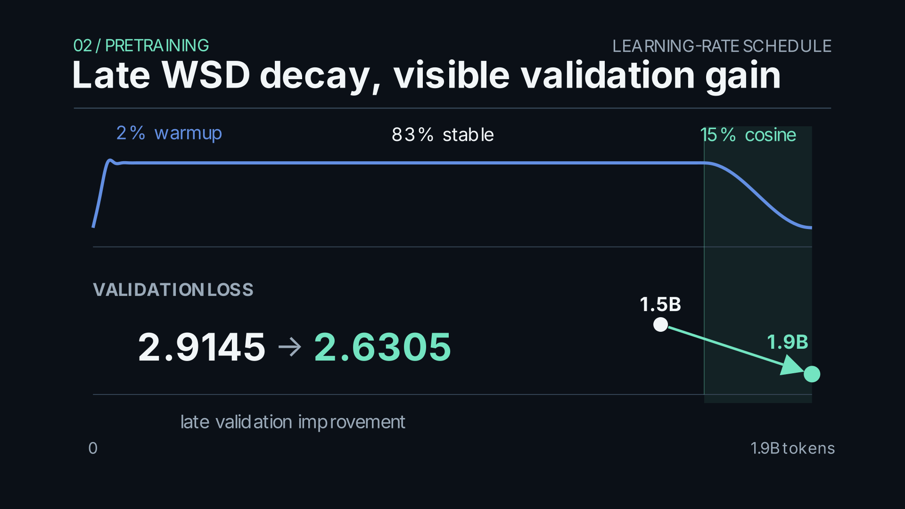
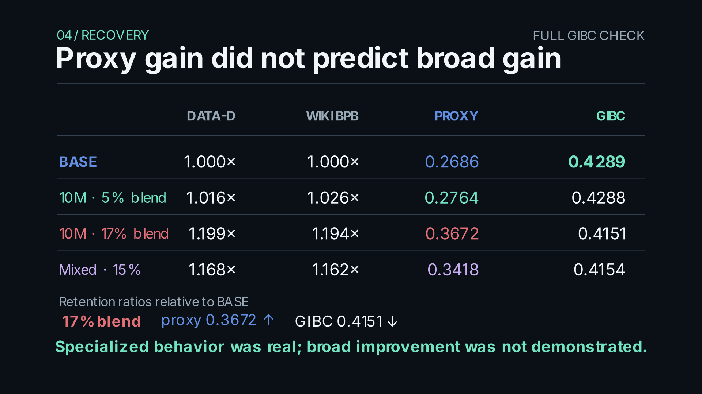

# LatticeLM

LatticeLM is a sub-50M-parameter language-model research project about architecture and training efficiency, rather than parameter scaling. Its final model has **48,636,168 parameters** and was trained from random initialization on **1.9B tokens** from DATA-D-v4. The model adapts the Co4 receptive-stream mechanism to causal language modeling, uses a Muon/AdamW optimizer split, and was selected after a broader post-training comparison retained the original **BASE** checkpoint.

## Key results

| Measure | Final result |
|---|---:|
| Parameters | 48,636,168 |
| Pretraining tokens | 1.9B |
| Training hardware | Google Cloud `c4a-standard-16`: 16 Google Axion CPU cores, 64 GB RAM, no GPU or TPU |
| Production training time | 7.73525463 days (185.646 hours) |
| Whole-run throughput | ≈2,842.9 tokens/s |
| Recorded CPU utilization | ≈1,550% process CPU, or ≈15.5/16 cores busy (≈96.9% aggregate core utilization) |
| Approx. production pretraining compute | ≈5.54 × 10^17 FLOPs (0.554 EFLOP, conventional 6NT estimate) |
| DATA-D validation loss | 2.630494 |
| WikiText-103 perplexity | 21.9298 |
| WikiText-103 bits per byte | 1.413462 |
| HellaSwag accuracy | 0.27096 |
| ARC-Easy accuracy | 0.36785 |
| PIQA accuracy | 0.56692 |
| WinoGrande accuracy | 0.50987 |

The benchmark values are the final BASE checkpoint evaluation. The separate 256-example reasoning proxy used during post-training is a screening metric and is not included in this table. Evaluation protocol, checkpoint, tokenizer, and data-manifest hashes are recorded in [`artifacts/reports/final_production_report.md`](artifacts/reports/final_production_report.md) and [`artifacts/manifests/final_production_provenance.json`](artifacts/manifests/final_production_provenance.json).

## Architecture

The final model has 12 Co4 causal blocks, width 552, a 1,728-wide SwiGLU feed-forward path, context length 256, and a 4,096-token vocabulary. Embeddings are untied. Each attention layer has six query heads and two key/value heads (real 6Q/2KV GQA), with QK-RMS normalization and rotary position embeddings. The reported 48,636,168-parameter total includes the trainable embeddings and output head; the exact production configuration is preserved in [`configs/final_production.json`](configs/final_production.json).

Co4 applies the learned receptive-stream transform

$$
\mathrm{Co4}(r,c)=\mathrm{ReLU6}\left(r^2+2r+c\left(1+|r|\right)\right)
$$

to query, key, and value contexts before causal attention. Here $r$ is a learned latent receptive stream and $c$ is the token-conditioned context. The final language-model adaptation keeps this elementwise MOD law and learned latent streams, then uses causal scaled dot-product attention. It is an adaptation for autoregressive modeling, not an exact reproduction of the original vision operator. See [Architecture](docs/ARCHITECTURE.md) and the [architecture figure](video/final/screenshots/01_architecture.png).

## Training

The final recipe used DATA-D-v4, with **2,259,629,459 certified available tokens**, of which 1.9B were consumed. The optimizer assigns hidden two-dimensional matrices to Muon and embeddings, output head, norms, and latents to AdamW: 90.65% and 9.35% of parameters, respectively. The peak learning rate was 0.0008, with a 2% warmup, 83% stable phase, and 15% cosine decay.

The full production run was executed entirely on a Google Cloud `c4a-standard-16` VM with 16 Google Axion CPU cores and 64 GB of RAM; no GPU or TPU acceleration was used. The recorded run duration was **7.73525463 days, or 185.646 hours**, which corresponds to an average whole-run throughput of approximately **2,842.9 tokens per second** across the 1.9B-token production run. CPU records were consistently around **1,550% process utilization** on the 16-core host, equivalent to roughly 15.5 cores being occupied on average, or about **96.9% aggregate core utilization**.

For cross-project normalization, the production pretraining compute is estimated with the conventional $6NT$ approximation:

$$
C\approx 6NT
=6(48{,}636{,}168)(1.9\times10^9)
\approx5.54\times10^{17}\ \text{FLOPs}
=0.554\ \text{EFLOP}.
$$

Co4 follows the $6NT$ approximation closely enough at this configuration for the estimate to be useful, although it still excludes optimizer work, data preparation, evaluation, and the separate experimental runs that preceded the final model.

Validation loss improved from **2.914503 at 1.5B tokens** to **2.630494 at 1.9B tokens**, during the late decay portion of training. The values and hashes are in the [production report](artifacts/reports/final_production_report.md); a compact two-point validation curve is available as [`artifacts/metrics/final_validation_curve.csv`](artifacts/metrics/final_validation_curve.csv). See [Training](docs/TRAINING.md) for data, optimizer, schedule, and run details.



## CPU training context

The single-node CPU constraint is unusual enough to require careful comparison rather than a broad record claim. A targeted search of published papers, public model cards, and open-source repositories conducted on **October 1, 2026** found no larger publicly documented causal language model than LatticeLM's 48,636,168 trainable parameters that combined at least one billion tokens of pretraining from random initialization, one CPU-only physical node, and conventional full-model next-token training without dynamic sparsity, MoE routing, or sampled, hierarchical, class-based, or partially connected output approximations.

This is a dated literature and public-repository search result, not a certified world record. Larger nominal CPU-trained language models do exist: historical RNN systems reached billions of parameters by using sampled, hierarchical, class-dependent, or partially connected output computation, while ThirdAI's BOLT2.5B uses dynamic sparse activation and multiple high-core-count CPU systems. Those results are important but represent a different computational regime from running LatticeLM's ordinary training path for 1.9B tokens on one 16-core host. The comparison criteria, historical counterexamples, recent near-misses, and source links are documented in [`docs/CPU_TRAINING_CONTEXT.md`](docs/CPU_TRAINING_CONTEXT.md) so that this statement can be updated if a qualifying public counterexample is found.

## Post-training study

Targeted ranking and joint objectives produced large gains on the reasoning proxy. Those gains did not transfer to the full GIBC evaluation, and the strongest specialization substantially harmed language-model retention. Recovery annealing restored much of the retention at small blend weights, while larger weights retained more proxy improvement and reduced GIBC performance. The targeted proxy and broad evaluation measure different behavior; the final selection therefore remained BASE.

| Candidate | DATA-D vs BASE | WikiText BPB vs BASE | Reasoning proxy | GIBC mean |
|---|---:|---:|---:|---:|
| BASE | 1.000× | 1.000× | 0.2686 | 0.4289 |
| 10M recovery, 5% | 1.016× | 1.026× | 0.2764 | 0.4288 |
| 10M recovery, 17% | 1.199× | 1.194× | 0.3672 | 0.4151 |
| Mixed objective, 15% | 1.168× | 1.162× | 0.3418 | 0.4154 |

The GIBC mean is the full-suite result; proxy accuracy is a separate 256-example screening result. The report includes candidates without a completed GIBC evaluation and explains why they cannot replace BASE. See [Post-training](docs/POSTTRAINING.md), the [curated comparison](artifacts/metrics/final_posttraining_comparison.json), and the [post-training report](artifacts/reports/posttraining_final_report.md).



## Repository map

| Path | Purpose |
|---|---|
| `src/latticelm/` | Model, data pipeline, optimizer, evaluation, and post-training implementation |
| `configs/` | Smoke, research, and final production/recipe configurations |
| `scripts/` | Dataset certification, training, evaluation, benchmarks, and experiment drivers |
| `tests/` | Unit and integration coverage for model behavior and experiment state machines |
| `artifacts/` | Historical tracked evidence plus curated final reports, metrics, and manifests |
| `video/` | Reproducible Manim source, metric inputs, build scripts, and final stills |

## Reproduction

The final run depends on the certified DATA-D-v4 token shards and tokenizer, which are deliberately not stored in Git. Create an environment and install the project and evaluation dependencies:

```bash
python3 -m venv .venv
. .venv/bin/activate
python -m pip install -e '.[evaluation]' pytest
```

The following commands show the verified interfaces. Dataset construction and full training are compute- and storage-intensive; they are not run as part of this documentation pass.

```bash
python scripts/build_data_d_v4.py --help
python scripts/train_final_production.py --help
python scripts/evaluate_wikitext103.py --help
python scripts/evaluate_gibc.py --help
python scripts/run_posttraining_master.py --help
python -m pytest -q
```

For an existing certified manifest and tokenizer, the production trainer accepts:

```bash
DEADLINE_EPOCH="$(date -u -d '+8 days' +%s)"
python scripts/train_final_production.py \
  --config configs/final_production.json \
  --manifest artifacts/data/data_d_v4/canonical-2250m/manifest.json \
  --tokenizer artifacts/tokenizers/final_corpus_4k.json \
  --target-tokens 1900000000 \
  --deadline-epoch "$DEADLINE_EPOCH" \
  --backend compile --fresh
```

To evaluate a checkpoint, provide its local path and the same tokenizer:

```bash
python scripts/evaluate_wikitext103.py --checkpoint CHECKPOINT.pt \
  --tokenizer artifacts/tokenizers/final_corpus_4k.json \
  --output artifacts/wikitext-final.json
python scripts/evaluate_gibc.py --checkpoint CHECKPOINT.pt \
  --tokenizer artifacts/tokenizers/final_corpus_4k.json \
  --output artifacts/gibc-final.json
```

The `--help` output for these interfaces was checked against the current scripts. Full evaluation requires the checkpoint and dataset access configured for the project. [Reproducibility](docs/REPRODUCIBILITY.md) documents inputs, hashes, expected outputs, and scope; [video build instructions](video/README.md) cover the visual package.

## Experimental artifacts

Curated final evidence is indexed in [`artifacts/README.md`](artifacts/README.md). It includes the production report, checkpoint comparison, post-training and recovery analysis, metric summaries, provenance hashes, and compact validation curve. Full model checkpoints, raw logs, transient run state, intermediate candidates, and generated QA frames are excluded from Git because they are large or reproducible execution output. Existing tracked historical research artifacts remain in place.

## AI assistance

ChatGPT was used as a research, planning, repository-analysis, and documentation assistant during development, while Codex was used as a coding assistant for implementation, debugging, and parts of the post-training infrastructure. The author directed the research questions, architecture, experimental design, training methodology, evaluation protocol, checkpoint selection, and final claims. AI assistance was therefore part of the development workflow, but the reported experiments and conclusions were selected against the project's recorded evaluation and provenance rather than accepted from an assistant without verification.

## Limitations

This is a small-scale model study; its results do not establish scaling behavior at larger model sizes. The targeted reasoning proxy did not predict GIBC transfer, so broad evaluation remains necessary for future post-training selection. The specialization/retention tradeoff and its dependence on training data and candidate weight deserve further study.

## Further reading

- [Architecture](docs/ARCHITECTURE.md)
- [Training](docs/TRAINING.md)
- [CPU training context](docs/CPU_TRAINING_CONTEXT.md)
- [Post-training](docs/POSTTRAINING.md)
- [Reproducibility](docs/REPRODUCIBILITY.md)
- [Original experiment protocol](EXPERIMENT_LATTICELM.md)