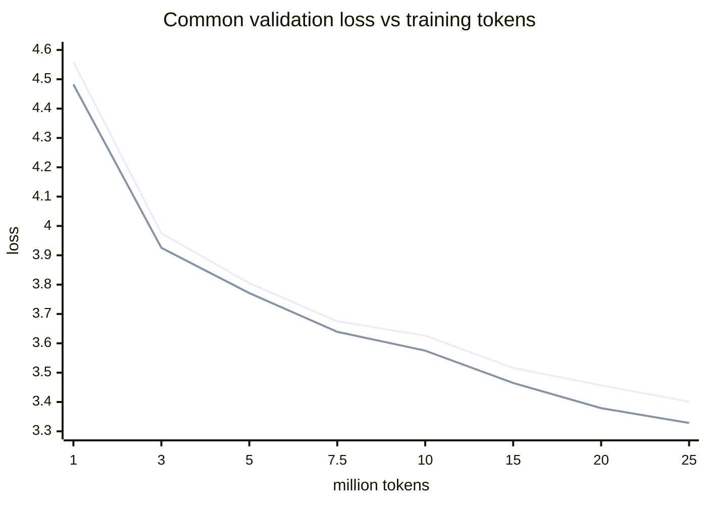
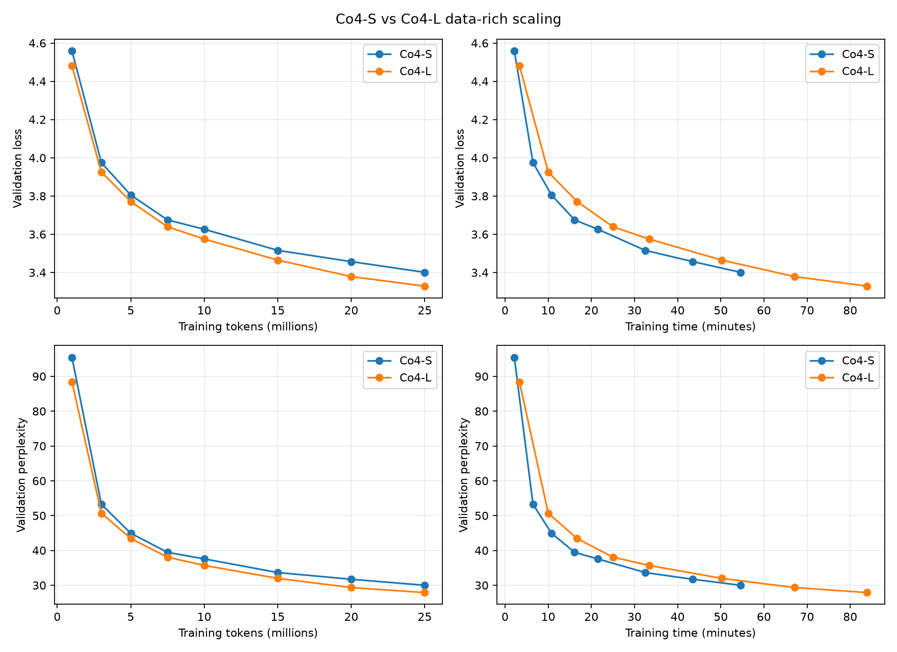

# Data-rich scaling analysis

Observed points only; 25M is still an early scaling point and no asymptote is claimed.

The first line is Co4-S and the second is Co4-L. The source CSV supports the required loss and perplexity plots against tokens and cumulative wall time.

| Model | Interval | loss improvement / M tokens |
|---|---:|---:|
| Co4-S | 7.5M→10M | 0.019545 |
| Co4-S | 10M→15M | 0.022067 |
| Co4-S | 15M→20M | 0.011778 |
| Co4-S | 20M→25M | 0.011211 |
| Co4-L | 7.5M→10M | 0.025729 |
| Co4-L | 10M→15M | 0.022004 |
| Co4-L | 15M→20M | 0.017190 |
| Co4-L | 20M→25M | 0.010071 |

At 10M the S−L loss gap is **0.051250**; at 25M it is **0.072295**. The larger-model advantage grew by 0.021045 loss (41.1% relative to the 10M gap), with a non-monotonic path at 15M. This supports result **A**, cautiously: the overall advantage grew materially, while the final 20M→25M slope was slightly better for S.

Equal-wall interpolation at the 10M comparison: in Co4-S's 1289.9s, Co4-L reaches approximately 6,441,906 tokens. In Co4-L's 2004.0s, Co4-S reaches approximately 15,410,938 tokens. These interpolations are descriptive, not observed checkpoints.
