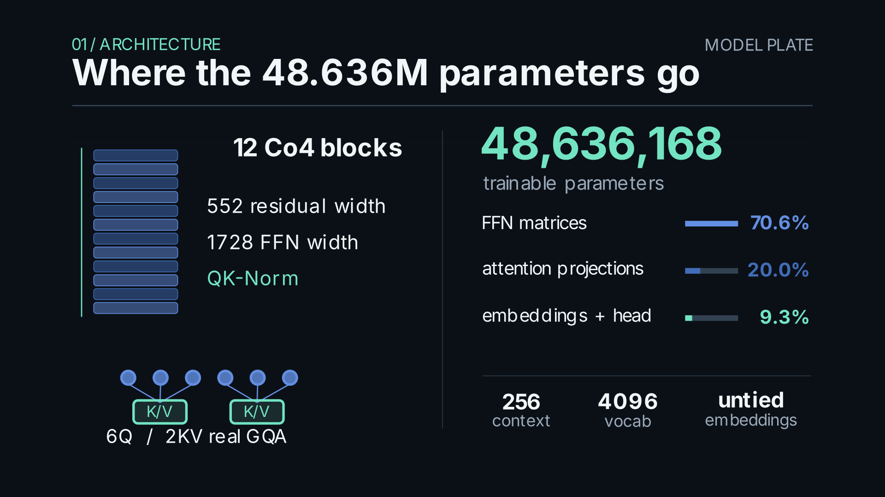

# Architecture

The selected BASE checkpoint is a 48,636,168-parameter decoder language model. It has 12 causal blocks with width 552, 6 query heads, 2 key/value heads, a 1,728-wide SwiGLU feed-forward path, and a 4,096-token vocabulary. The context length is 256. The token embedding and output head are untied. Each attention head has width 92.

## Co4 causal attention

Each attention block projects the normalized residual stream into query, key, and value contexts. A learned latent receptive vector is maintained for each query and key/value head. For each context element, the model applies the MOD transform

`MOD(r, c) = ReLU6(r² + 2r + c(1 + |r|))`

where `r` is the learned receptive latent and `c` is the projected token context. This conditions the projected streams before attention. The latent vectors are learned parameters, shared across sequence positions within a head; they do not introduce a separate recurrent state across tokens.

The query and key streams receive parameter-free per-head RMS normalization, then rotary position encoding. Causal scaled dot-product attention prevents a token from attending to future positions. Six query heads share two key/value projections, with three query heads per key/value group. The projection matrices therefore scale with two key/value heads while the attention output remains width 552.

This is a causal language-model adaptation of the elementwise Co4/MOD mechanism. It retains the receptive-stream law but replaces the non-causal readout used by the reference vision operator with causal attention. It should not be described as an exact reproduction of that vision architecture.

## Parameter allocation

| Component | Parameters |
|---|---:|
| SwiGLU feed-forward blocks | 34,338,816 |
| Attention projections | 9,750,528 |
| Token embeddings and output head | 4,521,984 |
| Latents and normalization | 24,840 |
| **Total** | **48,636,168** |

Muon updates eligible hidden two-dimensional matrices (44,089,344 parameters, 90.65%). AdamW updates token embeddings, the language-model head, normalization parameters, and latents (4,546,824 parameters, 9.35%). The parameter counts and run identity are recorded in [`../artifacts/manifests/final_production_provenance.json`](../artifacts/manifests/final_production_provenance.json).

